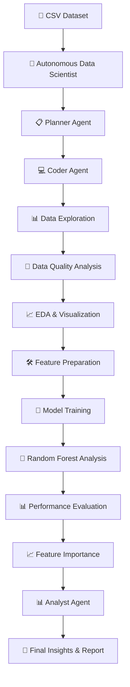
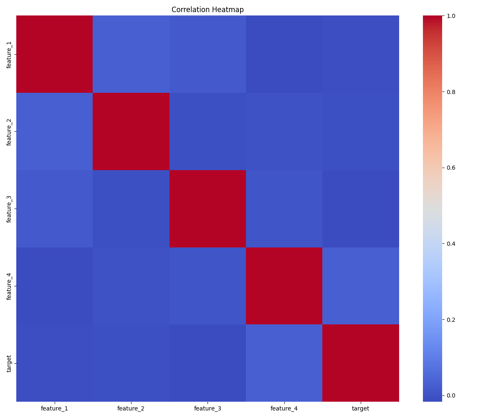
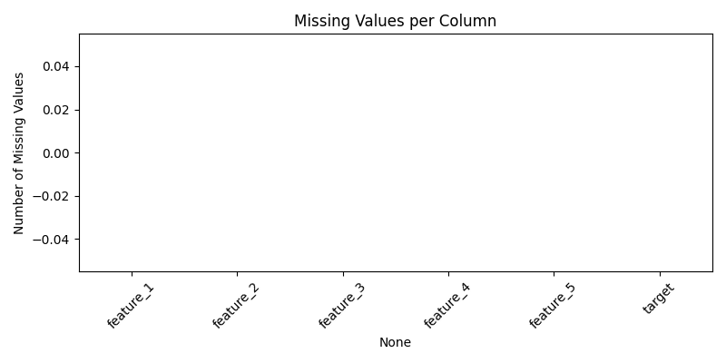
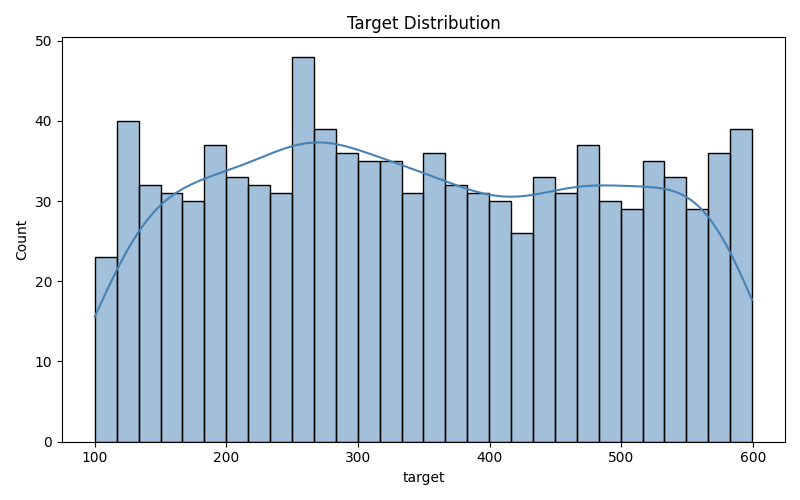
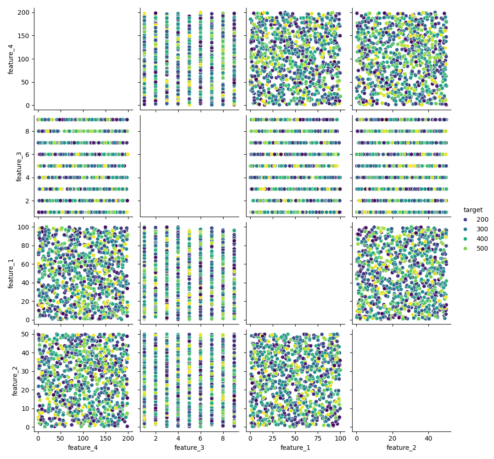
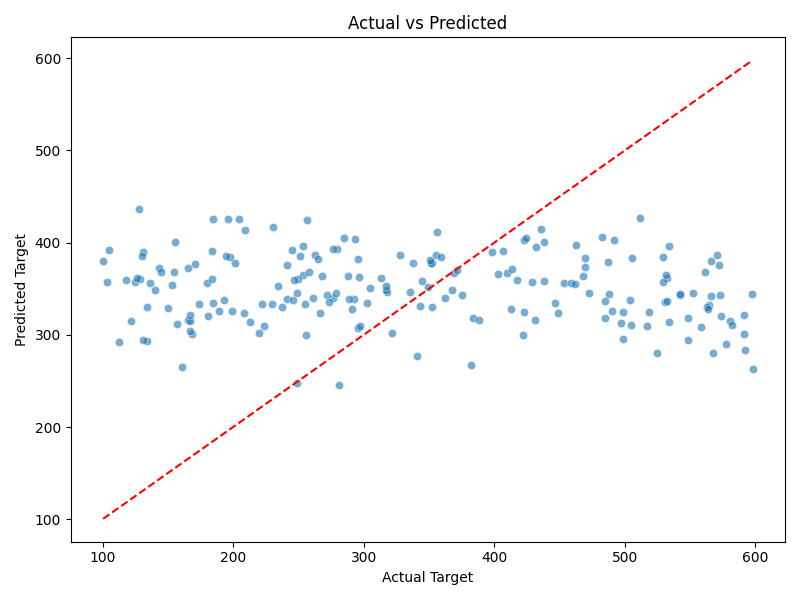
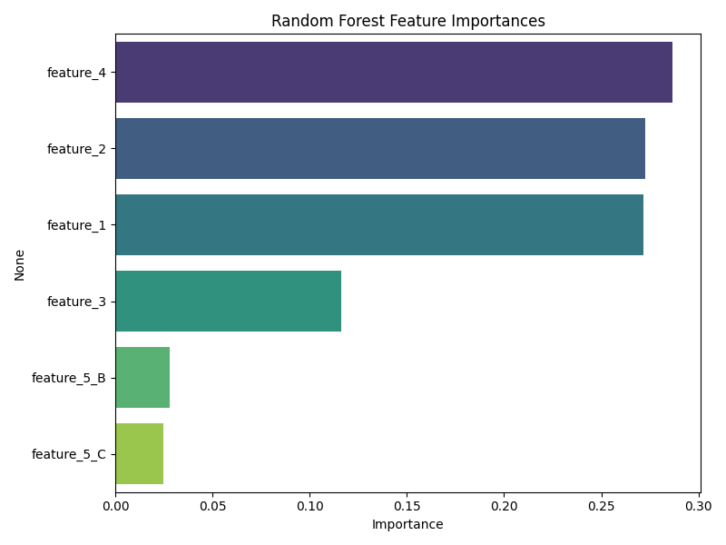
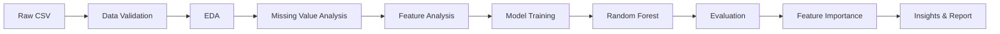

# 🤖 Autonomous Data Scientist

> **An AI-powered multi-agent data science system that helps automate exploratory data analysis, machine learning workflows, result interpretation, and report generation from CSV datasets.**

<p align="center">
  
  
  
  
  
  
  
</p>

<p align="center">
  <b>📊 Upload Data → 🤖 AI Agents Analyze → 🧠 Train Models → 📈 Generate Insights</b>
</p>

<p align="center">
  <i>"From raw CSV data to actionable insights — intelligently automated."</i> 🚀
</p>

---

# 📌 Overview

**Autonomous Data Scientist** is an AI-powered multi-agent system designed to automate important parts of a data science workflow.

The project uses specialized agents to help plan analysis, generate and execute data science workflows, and interpret results.

Given a CSV dataset, the system can support workflows such as:

- 📊 Exploratory Data Analysis
- 🔍 Missing value analysis
- 📈 Target distribution analysis
- 🔗 Correlation analysis
- 🛠️ Feature preparation
- 🧠 Machine learning model training
- 🌲 Random Forest analysis
- 📉 Actual vs Predicted visualization
- 🎯 Feature importance analysis
- 📝 Automated insights and reports

The application interface is designed around an **agent team**, including a Planner, Coder, and Analyst. The project output also includes EDA and Random Forest visualization artifacts.

---

# 🧠 Multi-Agent Architecture

| Agent | Role |
| :--- | :--- |
| 📋 **Planner Agent** | Creates a step-by-step analysis plan based on the dataset and task |
| 💻 **Coder Agent** | Generates or prepares Python-based data analysis and ML steps |
| 📊 **Analyst Agent** | Interprets outputs, insights, visualizations, and model results |
| 🧠 **Supervisor / Workflow** | Coordinates the overall multi-agent execution flow |

---

# 🔄 Workflow



---

# ✨ Key Features

| Feature | Description |
| :--- | :--- |
| 📂 **CSV Dataset Support** | Analyze CSV datasets through the application workflow |
| 📊 **Automated EDA** | Explore dataset structure, distributions, and relationships |
| 🧹 **Missing Value Analysis** | Identify and visualize missing values |
| 🎯 **Target Distribution** | Visualize the distribution of the target variable |
| 🔗 **Correlation Analysis** | Generate correlation heatmaps for numerical features |
| 📈 **Feature Relationships** | Visualize relationships between important features |
| 🧠 **ML Workflow** | Prepare data and train machine learning models |
| 🌲 **Random Forest Analysis** | Train and evaluate a Random Forest model |
| 🎯 **Feature Importance** | Identify influential features using Random Forest |
| 📉 **Actual vs Predicted** | Compare model predictions with actual values |
| 🤖 **Multi-Agent Workflow** | Planner, Coder, and Analyst agents support the workflow |
| 🖥️ **Interactive UI** | Streamlit-based interface for interacting with the system |
| 📝 **Automated Reporting** | Generate summaries, findings, and recommendations |

---

# 🛠️ Tech Stack

| Layer | Technology | Purpose |
| :--- | :--- | :--- |
| **Language** | Python 3.11+ | Core programming language |
| **Agent Orchestration** | LangGraph | Multi-agent workflow orchestration |
| **LLM Backend** | Groq | AI-powered reasoning and agent tasks |
| **Data Processing** | Pandas | Dataset loading and manipulation |
| **Numerical Computing** | NumPy | Numerical operations |
| **Visualization** | Matplotlib | Data visualization |
| **Visualization** | Seaborn | Statistical visualization |
| **Machine Learning** | Scikit-learn | ML preprocessing, training, and evaluation |
| **Dashboard** | Streamlit | Interactive user interface |
| **Model Analysis** | Random Forest | Baseline/tree-based regression analysis |

---

# 📂 Project Structure

```text
autonomous-data-scientist/
│
├── src/
│   ├── agents/
│   │   ├── planner.py
│   │   ├── coder.py
│   │   ├── analyst.py
│   │   └── supervisor.py
│   │
│   ├── executor.py
│   ├── state.py
│   └── app.py
│
├── data/
│   └── Uploaded and project datasets
│
├── results/
│   └── Generated analysis outputs and reports
│
├── generate_data.py
│
├── sample_data.csv
├── iris.csv
│
├── correlation_heatmap.png
├── missing_values_bar.png
├── pairplot_top_features.png
├── target_distribution.png
├── rf_actual_vs_predicted.png
├── rf_feature_importances.png
│
├── requirements.txt
└── README.md
```

---

# 📊 Analysis Outputs

The project generates visual outputs for exploratory data analysis and model interpretation.

## 🔗 Correlation Heatmap

```text
correlation_heatmap.png
```

Visualizes relationships between numerical features.



---

## 🧹 Missing Values Analysis

```text
missing_values_bar.png
```

Displays missing-value information across dataset columns.



---

## 🎯 Target Distribution

```text
target_distribution.png
```

Shows how the target variable is distributed.



---

## 📈 Feature Relationships

```text
pairplot_top_features.png
```

Visualizes relationships between selected important features.



---

# 🌲 Random Forest Model Analysis

The project includes Random Forest-based model analysis and visualization.

## 📉 Actual vs Predicted

This visualization compares actual target values with model predictions.

```text
rf_actual_vs_predicted.png
```



---

## 🎯 Feature Importances

This visualization highlights the relative importance of features according to the Random Forest model.

```text
rf_feature_importances.png
```



---

# 🖥️ Application Workflow

The Streamlit application provides a workflow similar to:

### 1️⃣ Upload Dataset

Upload or select a CSV dataset for analysis.

Example project datasets include:

```text
sample_data.csv
iris.csv
```

---

### 2️⃣ Inspect Dataset

The application can display information such as:

- Number of rows
- Number of columns
- Dataset preview
- Memory usage
- Data structure

---

### 3️⃣ Select Target Column

Specify the column that should be used as the target for the machine learning task.

```text
Target Column
        ↓
Feature / Target Separation
        ↓
Model Training
        ↓
Evaluation
```

---

### 4️⃣ Run Autonomous Analysis

The multi-agent workflow coordinates the analysis process.

```text
Planner
   ↓
Creates Analysis Plan
   ↓
Coder
   ↓
Prepares Analysis / ML Steps
   ↓
Executor
   ↓
Runs Workflow
   ↓
Analyst
   ↓
Interprets Results
   ↓
Final Report
```

---

# 🚀 Getting Started

## Prerequisites

Before running the project, make sure you have:

- Python `3.11+`
- Conda *(optional but recommended)*
- A Groq API Key if your agent workflow requires LLM access

---

## 1️⃣ Clone the Repository

```bash
git clone https://github.com/vaibhav07772/autonomous-data-scientist.git
cd autonomous-data-scientist
```

---

## 2️⃣ Create a Conda Environment

```bash
conda create -n auto-ds python=3.11 -y
conda activate auto-ds
```

---

## 3️⃣ Install Dependencies

```bash
pip install -r requirements.txt
```

---

## 4️⃣ Configure Environment Variables

If your project uses Groq, create a `.env` file in the project root:

```env
GROQ_API_KEY=your_groq_api_key_here
```

> ⚠️ Never upload your real API key to GitHub. Add `.env` to `.gitignore`.

Example `.gitignore` entry:

```text
.env
__pycache__/
*.pyc
```

---

## 5️⃣ Run the Application

Based on the project structure:

```bash
streamlit run src/app.py
```

Then open:

```text
http://localhost:8501
```

---

# 🧪 Running the Project

Activate the environment first:

```bash
conda activate auto-ds
```

Then install dependencies:

```bash
pip install -r requirements.txt
```

Start the Streamlit application:

```bash
streamlit run src/app.py
```

---

# 📡 How to Use

### Step 1 — Upload or Select Data

Choose a CSV dataset.

Example:

```text
sample_data.csv
```

or:

```text
iris.csv
```

### Step 2 — Choose the Target

Enter or select the target column for your ML task.

### Step 3 — Run the Agent Workflow

Click the application button to begin analysis.

The workflow can perform:

```text
📋 Planning
      ↓
💻 Code / Analysis Preparation
      ↓
📊 Exploratory Data Analysis
      ↓
🧹 Data Quality Checks
      ↓
🧠 Machine Learning
      ↓
📈 Model Evaluation
      ↓
📊 Result Interpretation
      ↓
📝 Final Report
```

### Step 4 — Review Results

Review generated:

- Data summary
- EDA visualizations
- Missing value analysis
- Correlation analysis
- Target distribution
- Feature relationships
- Model outputs
- Actual vs Predicted plot
- Feature importance plot
- Final report and recommendations

---

# 🧠 Data Science Pipeline



---

# 📊 Generated Visualizations

| Visualization | File |
| :--- | :--- |
| 🔗 Correlation Heatmap | `correlation_heatmap.png` |
| 🧹 Missing Values Bar Chart | `missing_values_bar.png` |
| 📈 Feature Pairplot | `pairplot_top_features.png` |
| 🎯 Target Distribution | `target_distribution.png` |
| 📉 Actual vs Predicted | `rf_actual_vs_predicted.png` |
| 🌲 Random Forest Feature Importance | `rf_feature_importances.png` |

---

# 💡 Example Use Cases

This project can be extended for:

- 📊 Automated dataset exploration
- 🤖 AI-powered data analysis
- 🏦 Financial data analysis
- 🛒 Sales prediction
- 🏠 Price prediction
- 📈 Business analytics
- 🎓 Educational datasets
- 🔬 Research data exploration
- ⚙️ Automated ML experimentation

---

# ❓ Frequently Asked Questions

### Q1. What is an Autonomous Data Scientist?

It is an AI-powered system designed to automate parts of a traditional data science workflow, such as planning analysis, exploring data, training models, and interpreting results.

---

### Q2. What type of dataset does the project use?

The project is designed around CSV-based datasets.

Example files included in the project:

```text
sample_data.csv
iris.csv
```

---

### Q3. Which agents are used?

The workflow includes specialized roles such as:

- 📋 Planner
- 💻 Coder
- 📊 Analyst
- 🧠 Supervisor / Orchestration layer

---

### Q4. What EDA outputs are generated?

The project includes outputs for:

- Missing values
- Correlation heatmap
- Target distribution
- Pairplot of selected features

---

### Q5. Which model analysis is currently included?

The repository includes Random Forest model analysis outputs such as:

- Actual vs Predicted
- Feature Importances

---

### Q6. Can I use my own CSV?

Yes. You can extend or use the application workflow with your own CSV dataset and configure the appropriate target column.

---

### Q7. Does the project require a Groq API key?

If the LangGraph agent workflow is configured to use Groq as its LLM backend, then a valid `GROQ_API_KEY` is required.

---

# 🔮 Future Improvements

- [ ] 🧠 Add automatic problem type detection
- [ ] 📊 Automatic classification vs regression detection
- [ ] ⚙️ Hyperparameter tuning with Optuna
- [ ] 🚀 Add XGBoost model comparison
- [ ] 🤖 Add more specialized AI agents
- [ ] 🔍 Automated feature engineering
- [ ] 📈 Cross-validation and robust model selection
- [ ] 🧠 SHAP explainability
- [ ] 🔎 LIME explanations
- [ ] 💾 Save trained models with Joblib
- [ ] ⚡ Add FastAPI backend
- [ ] 🐳 Docker containerization
- [ ] 📡 MLflow experiment tracking
- [ ] 📊 Evidently AI drift monitoring
- [ ] ☁️ Cloud deployment
- [ ] 🔐 Multi-user support
- [ ] 📄 Export reports as PDF

---

# 🤝 Contributing

Contributions are welcome! 🎉

If you would like to contribute:

1. Fork the repository
2. Create a new branch
3. Make your changes
4. Commit your changes
5. Push the branch
6. Open a Pull Request

### Code Style

- Use `black` for Python formatting
- Use `isort` for import sorting
- Write modular and readable code
- Add docstrings where appropriate
- Use meaningful commit messages

---

# 📜 License

This project is licensed under the **MIT License**.

You are free to use, modify, and distribute the project.

---

# 📬 Connect with the Author

**Vaibhav Singh**

- 🐙 GitHub: [@vaibhav07772](https://github.com/vaibhav07772)
- 💼 LinkedIn: [Vaibhav Singh](https://www.linkedin.com/in/vaibhav07772/)
- 📧 Email: vs9502778@gmail.com

---

# ⭐ Show Your Support

If you find this project useful, please consider giving it a **star ⭐** on GitHub!

Your support helps the project reach more developers and data science enthusiasts.

---

<p align="center">
  <b>🤖 Autonomous Data Scientist</b>
</p>

<p align="center">
  <i>"From raw data to insights — intelligently automated."</i> 🚀
</p>

<p align="center">
  Made with ❤️ by <b>Vaibhav Singh</b>
</p>